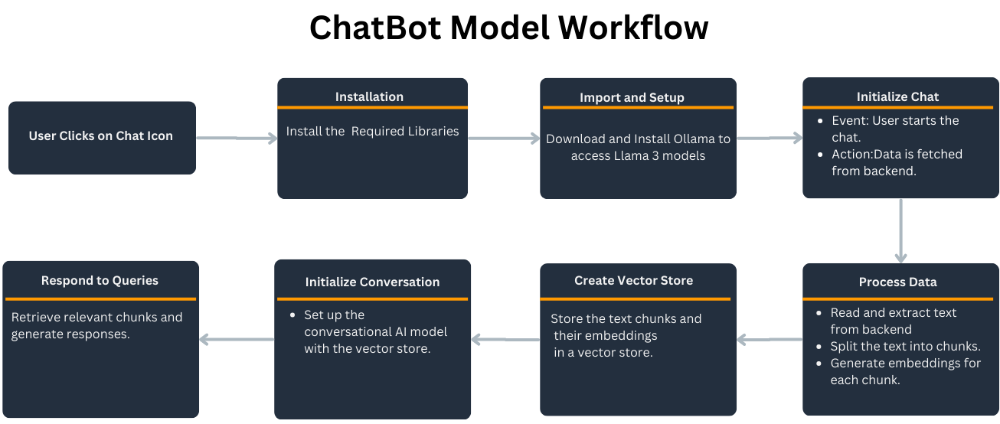
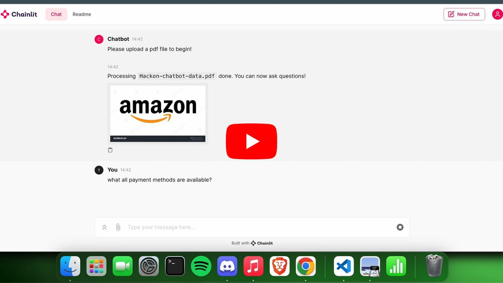
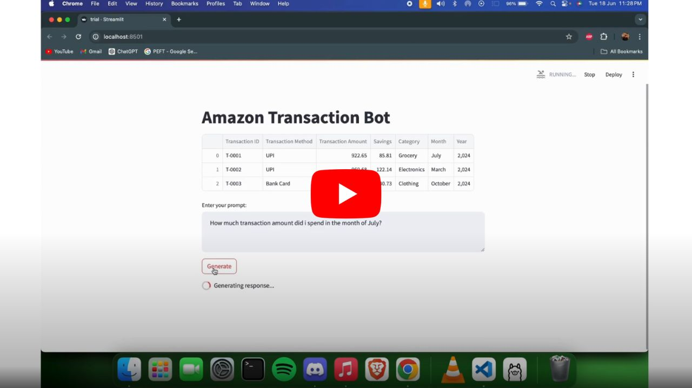
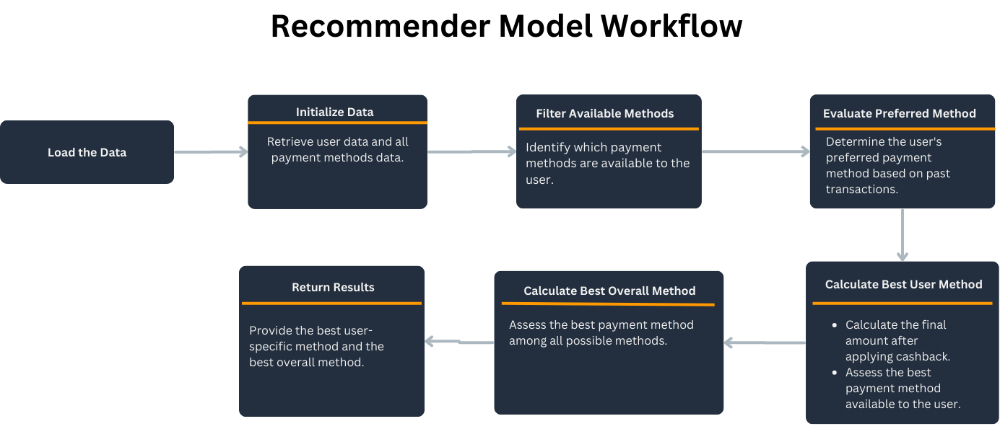

# Amazon HackOn Season 4
**Theme** - Personalized Payment Experiences and Financial Management
1. AI-powered chatbot automates handling of customer payment queries.

2. Automated budgeting solution allows customers to set limits on purchasing amount and receive notifications for thresholds. Tracking savings on a yearly, monthly, and overall basis.Monitoring spending across different product categories. 

3. AI-generated recommendation engine suggests best payment method based on payment history, success rates,cashbacks, and costs.

# Amazon Expense Tracker

## Overview

The Amazon Expense Tracker is a comprehensive tool designed to help users monitor and manage their expenses and savings related to Amazon purchases. This project offers several features including a dynamic expense tracking dashboard, a payment method recommender, and a versatile chatbot. The tech stack includes Django, HTML, CSS, JavaScript, Python, Llama 3, Ollama, and PandasAI.

## Features

### 1. Expense Tracking Dashboard

The Expense Tracking Dashboard is divided into two main sections: Savings and Expenses.

#### Expenses Section
- **Expense Limits:** Allows users to set spending limits on different product categories.
- **Dynamic Graphs:** Visualizes expenses through interactive graphs, helping users understand their spending patterns.
- **Email Alerts:** Get email alerts when expenditure limits are reached.

#### Savings Section
- **Dynamic Graphs:** Provides insightful graphs related to savings, enabling users to track their progress and make informed financial decisions.

**Tech Stack:** Django, HTML, CSS, JavaScript

### 2. Payment Method Recommender

The Payment Method Recommender uses a sophisticated algorithm to analyze previous transactions and current available payment methods. It then recommends the most beneficial payment method for the user and the overall best payment method.

**Tech Stack:** Python

### 3. Chatbot

The chatbot is capable of handling a variety of queries related to:
- Amazon orders
- Tracking information
- Payments
- User-specific expense and savings data

The chatbot leverages the power of Llama 3, Ollama, and PandasAI to provide accurate and relevant responses.

**Tech Stack:** Llama 3, Ollama, Python, PandasAI

## Gallery
### Chatbot
* Chatbot Workflow
  
  
  
* Payment query chatbot

    [](https://www.youtube.com/watch?v=MflhO6bCONM)

* Transaction Query Chatbot

    [](https://www.youtube.com/watch?v=DsAk5kT2aU4)
  
### Payment Recommender
* Payment recommender workflow
  
   
### Expense Tracker

## Getting Started

### Prerequisites
- Python 3.x
- Django
- HTML, CSS, JavaScript
- Dependencies for Llama 3, Ollama, PandasAI

### Installation

1. Clone the repository:
   ```sh
   git clone https://github.com/PranavPC2003/Amazon-HackOn-S4

2. Navigate to the project directory:
    ```sh
    cd amazon-expense-tracker

3. Run the Django server:
   ```sh
   python manage.py runserver

## Usage
* Access the Expense Tracking Dashboard through your web browser.
* Set your expense limits and view dynamic graphs for a better understanding of your financial habits.
* Use the Payment Method Recommender to get the best payment suggestions.
* Interact with the chatbot to get answers to your queries about Amazon orders, tracking, payments, and personal expense/savings data.


 


