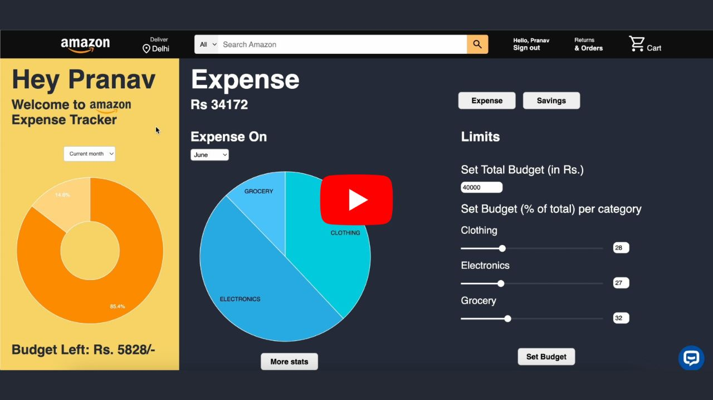

# Amazon HackOn Season 4
**Theme** - Personalized Payment Experiences and Financial Management
1. AI-Powered Chatbot automates handling of customer payment queries.

2. Automated Budgeting Solution allows customers to set limits on purchasing amount and receive notifications for thresholds. Tracking savings on a yearly, monthly, and overall basis.Monitoring spending across different product categories. 

3. AI-Generated Recommendation Engine suggests best payment method based on payment history, success rates,cashbacks, and costs.

# Amazon Expense Tracker

## Overview

The Amazon Expense Tracker is a comprehensive tool designed to help users monitor and manage their expenses and savings related to Amazon purchases. This project offers several features including a dynamic expense tracking dashboard, a payment method recommender, and a versatile chatbot. The tech stack includes Django, HTML, CSS, JavaScript, Python, Llama 3, Ollama, and PandasAI.

## Features

### 1. Expense Tracking Dashboard

The Expense Tracking Dashboard is divided into two main sections: Savings and Expenses.

#### Expenses Section
- **Expense Limits:** Allows users to set spending limits on different product categories.
- **Dynamic Graphs:** Visualizes expenses through interactive graphs, helping users understand their spending patterns.
- **Email Alerts:** Get email alerts when expenditure limits are reached.

#### Savings Section
- **Dynamic Graphs:** Provides insightful graphs related to savings, enabling users to track their progress and make informed financial decisions.

**Tech Stack:** Django, HTML, CSS, JavaScript

### 2. Payment Method Recommender

The Payment Method Recommender uses a sophisticated algorithm to analyze previous transactions and current available payment methods. It then recommends the most beneficial payment method for the user and the overall best payment method.

**Tech Stack:** Python

### 3. Chatbot

The chatbot is capable of handling a variety of queries related to:
- Amazon orders
- Tracking information
- Payments
- User-specific expense and savings data

The chatbot leverages the power of Llama 3, Ollama, and PandasAI to provide accurate and relevant responses.

**Tech Stack:** Llama 3, Ollama, Python, PandasAI

## Vision for future development (not included in prototype)
### Customer Incentive system 
#### Overview
The incentive system aims to enhance user engagement by rewarding users who save the most money and make the most purchases through the Amazon Expense Tracker. The system will provide points based on savings and purchases, and users can redeem these points for various rewards. This plan outlines the objectives, target audience, key features, implementation strategy, and revenue model.
#### Objectives
* Increase User Engagement: Encourage users to actively track their expenses and savings.
* Promote Financial Responsibility: Motivate users to save more and manage their expenses better.
* Enhance User Retention: Offer rewards to keep users returning to the platform.
* Boost Brand Loyalty: Strengthen the relationship between the platform and its users through positive reinforcement.
#### Target Audience
* Amazon Shoppers: Individuals who frequently purchase items from Amazon and are interested in managing their finances.
* Budget-Conscious Consumers: Users who aim to save money and track their expenses meticulously.
* Tech-Savvy Users: Individuals who are comfortable using online tools and apps for financial management.
#### Key Features
1. Points Calculation System
 * Savings-Based Points: Users earn points for the amount of money they save.
 * Purchase-Based Points: Users earn points for the number of purchases they make.
2. Leaderboard
 * Displays top savers and top purchasers, updated weekly.
3. Rewards Redemption
 * Users can redeem their points for rewards such as discount coupons, gift cards, or 
   exclusive deals.
4. Notification System
 * Users receive notifications when they reach milestones, can redeem rewards, or when new rewards are available.
#### Revenue Model
1. Premium Memberships: Offer premium memberships that provide additional points or exclusive rewards.
2. Affiliate Marketing: Partner with brands to offer rewards, earning a commission on user redemptions.
3. Advertisements: Display targeted advertisements based on user purchase and savings behavior.
4. Data Insights: Provide anonymized data insights to partners, helping them understand consumer behavior.


## Gallery
### Chatbot
* Chatbot Workflow
  
  
  
* Payment query chatbot

    [](https://www.youtube.com/watch?v=MflhO6bCONM)

* Transaction Query Chatbot

    [](https://www.youtube.com/watch?v=DsAk5kT2aU4)
  
### Payment Recommender
* Payment recommender workflow
  
   
### Expense Tracker

* Demo video for Expense Tracker and payment recommender
  
  [](https://www.youtube.com/watch?v=CTh3A3S2I60)
  
## Getting Started

### Prerequisites
- Python 3.x
- Django
- HTML, CSS, JavaScript
- Dependencies for Llama 3, Ollama, PandasAI

### Installation

1. Clone the repository:
   ```sh
   git clone https://github.com/PranavPC2003/Amazon-HackOn-S4
    
2. For Windows, create a virtual environment:
    ```sh
    virtualenv venv

3. Enter the virtual environment using the command:
    ```sh
    venv\Scripts\activate

4. Install dependencies:
    ```sh
    pip install django

5. Run the Django server:
   ```sh
   python manage.py runserver

(username - pranavpc, password - 123)

## Usage
* Access the Expense Tracking Dashboard through your web browser.
* Set your expense limits and view dynamic graphs for a better understanding of your financial habits.
* Use the Payment Method Recommender to get the best payment suggestions.
* Interact with the chatbot to get answers to your queries about Amazon orders, tracking, payments, and personal expense/savings data.


 


